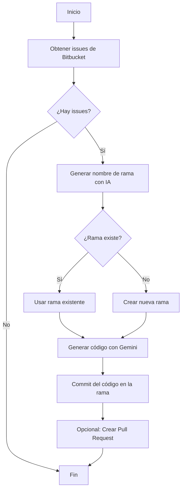

# Reviewer

Este proyecto está desarrollado en **Rust** y automatiza la resolución de issues de un repositorio de **Bitbucket** utilizando inteligencia artificial (modelo Gemini). El flujo principal consiste en leer los issues abiertos, generar código para resolverlos, crear una rama nueva y realizar un commit con la solución propuesta. Posteriormente, se puede automatizar la creación de un Pull Request (PR).

## Características principales
- **Lenguaje:** Rust
- **Integración con Bitbucket:** Obtiene issues, crea ramas y realiza commits automáticamente.
- **IA (Gemini):** Genera código para resolver los issues detectados.
- **Automatización del flujo de trabajo:** Desde la detección del issue hasta el commit en una nueva rama.

## Diagrama de flujo


## Ejemplo de uso

```bash
cargo run
```

## Fragmento de código principal
```rust
// ...existing code...
let base_commit = get_latest_commit(&client, &token, &repo, &user).await?;
// ...existing code...
match fetch_issues(&client, &token, &repo, &user).await {
    Ok(issues) => {
        for issue in issues {
            match generate_branch_name(&issue.id.to_string(), &issue.title).await {
                Ok(branch) => {
                    if !branch_exists(&client, &token, &repo, &user, &branch).await? {
                        create_branch(&client, &token, &repo, &user, &branch, &base_commit).await?;
                    }
                    let language = std::env::var("DEFAULT_LANG").unwrap_or_else(|_| "javascript".to_string());
                    let (file_path, code) = generate_fix_code(&issue.id.to_string(), &issue.title, &issue.content.raw, &language).await?;
                    commit_file(&client, &token, &repo, &user, &branch, &file_path, &code).await?;
                }
                Err(err) => println!("Error generando nombre de rama: {}", err),
            }
        }
    }
    Err(err) => println!("Error al obtener issues: {}", err),
}
// ...existing code...
```

## Variables de entorno
-

Estas variables deben estar definidas en un archivo `.env` en la raíz del proyecto:

```env
GEMINI_API_KEY=
BITBUCKET_USER=
BITBUCKET_TOKEN=
WORKSPACE=
REPO_SLUG=
```


## Requisitos

- Rust (recomendado: última versión estable)
- Acceso a un repositorio Bitbucket
- Token de acceso Bitbucket

## Instalación y ejecución
1. Clona el repositorio:
   ```bash
   git clone <url-del-repo>
   cd Reviewer
   ```
2. Configura las variables de entorno necesarias.
3. Ejecuta el proyecto:
   ```bash
   cargo run
   ```

---

¡Automatiza la resolución de issues y acelera tu flujo de trabajo con Rust + IA!
